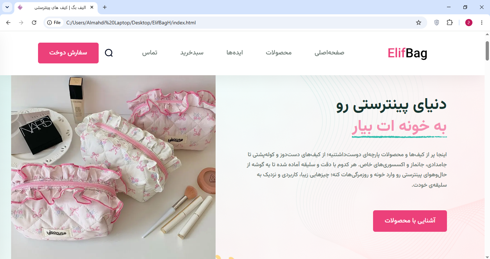
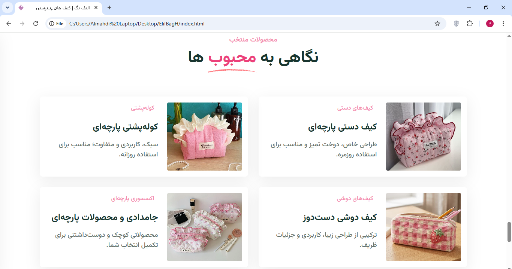

# Handmade Bags Frontend

A modern frontend website for a handmade bags store, designed to showcase handcrafted products through an attractive and user-friendly interface.

## Features

* Responsive user interface
* Product showcase
* Clean and modern design
* User-friendly navigation

## Technologies Used

* HTML
* CSS
* JavaScript

## Getting Started

1. Clone the repository:

   ```bash
   git clone YOUR_REPOSITORY_URL
   ```

2. Navigate to the project directory:

   ```bash
   cd handmade-bags-frontend
   ```

3. Open `index.html` in your browser.

## Project Preview



## Author

**Masoumeh Hoseini**

GitHub: [@MHoseini-Developer](https://github.com/MHoseini-Developer)


---

# فرانت‌اند وب‌سایت فروشگاه کیف‌های دست‌دوز

این پروژه، فرانت‌اند یک وب‌سایت فروشگاهی برای نمایش و معرفی کیف‌های دست‌دوز است که با هدف ارائه رابط کاربری جذاب، مدرن و کاربرپسند طراحی و پیاده‌سازی شده است.

## امکانات

* رابط کاربری واکنش‌گرا و سازگار با اندازه‌های مختلف صفحه‌نمایش
* نمایش محصولات فروشگاه
* طراحی مدرن و زیبا
* ناوبری ساده و کاربرپسند

## تکنولوژی‌های استفاده‌شده

* HTML
* CSS
* JavaScript

## نحوه اجرا

۱. مخزن پروژه را دریافت کنید:

```bash
git clone YOUR_REPOSITORY_URL
```

۲. وارد پوشه پروژه شوید:

```bash
cd handmade-bags-frontend
```

۳. فایل `index.html` را در مرورگر خود باز کنید.

## پیش‌نمایش پروژه



## توسعه‌دهنده

**معصومه حسینی**

گیت‌هاب: [@MHoseini-Developer](https://github.com/MHoseini-Developer)
